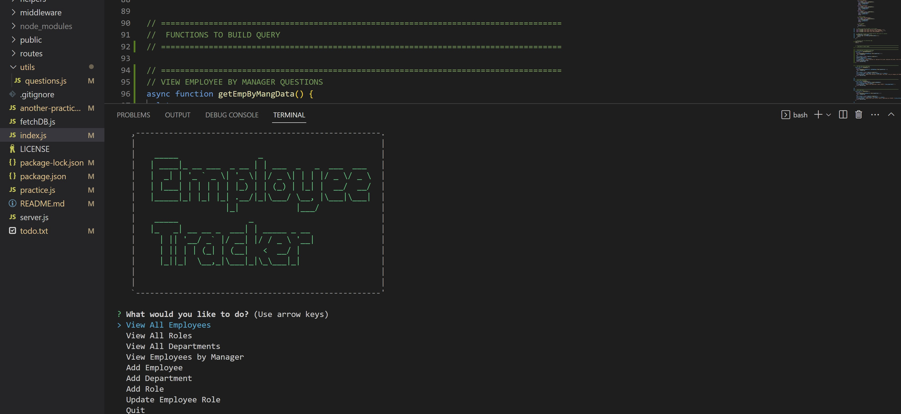

<header style="height: 100px; background: linear-gradient(to right, #000046, #1CB5E0);"><h1 style="font-size: 65px; text-align: center"><strong></strong>Employee Tracker</h1></header>

<br />

[](#license)


<br />

> # [Description](#description)
A simple command-line application that allows a user to view their companies employee database. This is a content management system (CMS), that makes it easy to navigate and update the employee database of a landscape company. 

<br />
<br />

---
<details>
<summary style="font-size: 25px">Table of Contents</summary> 

- [Description](#description)
- [Getting Started](#getting-started)
  - [Project Status](#project-status)
  - [Installation](#installation)
  - [Useage](#useage)
  - [Contributing Guidelines](#contributing)
  - [Test Instructions](#test) 
  - [License](#license)
- [Credits](#credits)
  - [Contributors](#contributors)
  - [Acknowledgements](#acknowledgements)
- [Questions](#questions)
</details>

<br />
<br />

---

> # [Getting Started](#getting-started)

<br />

## [Project Status](#project-status)
    MVP - Minimal Viable Product

<br />

To get a look at the code used for this application, checkout our <a href="https://github.com/werthird/Employee-Tracker-Module-12">GitHub Repo!</a> 

<br />

*Click on this [**LINK**](https://drive.google.com/file/d/1Q_YGXqgQVfHeAEa-ZDAMld36Zna5kbSJ/view) to get a walk through video of how to use the application.*

<br />

## [Installation](#installation)
If you are wanting to use this application on your own system, you will need to know a few things:

1.  This is a command-line application. It uses the NPM Module [**Inquirer.js**](https://www.npmjs.com/package/inquirer?activeTab=readme) and the NPM Module [**MYSQL2**](https://www.npmjs.com/package/mysql2). Please follow this link to read about it. 

2. Clone down this repo onto your local system.

3. After doing so, open a terminal in the Employee-Tracker-Module-12 file, and enter the following code to download the needed modules:
	```
	npm i
	```

<br />

## [Useage](#useage)
This is a command-line application that will take you through a series of prompts.

1. After the module is installed on your local system, you are ready to use this app. Enter this code into your terminal:
	```
	node index.js
	```

2. Follow the prompts in the command-line.
   

<br />

*Click on this [**LINK**](https://drive.google.com/file/d/1Q_YGXqgQVfHeAEa-ZDAMld36Zna5kbSJ/view) to get a walk through video of how to use the application.*

<br />



<br />

## [Contributing Guidelines](#contributing)
No contributing guidelines. For any suggestions or comments, please see [Questions](#questions) section below.

<br />

## [Test Instructions](#test)
No testing instructions at this time.

<br />

## [License](#license)
Distributed under the MIT License. See LICENSE.txt for more information.

<br />
<br />

---

> # [Credits](#credits)

<br />

## [Contributors](#contributors)
Devin Reilly

<br />

## [Acknowledgements](#acknowledgements)
- [The Full-Stack Blog](https://coding-boot-camp.github.io/full-stack/github/professional-readme-guide) - README Template 
- UCF Instructor **John Dinsmore**, and TA's, **Kristofer Marshall** and **Rider Cogswell**
- Students of UCF Coding Boot Camp, in class, on Slack and on Discord
- Research articles from Google Search, ChatGPT, MDN Docs, W3Schools

<br />
<br />

---

> # [Questions](#questions)

Here is a link to our <a href="https://github.com/werthird">GitHub profile page!</a>

Or send us an <a href="mailto: werthird@aol.com?subject=SVG Logo Maker Feedback">Email!</a>